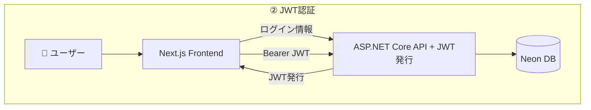

# 認証認可追加

## 構成



## 実装

### Auth.js インストール

- [NextAuth.js](https://next-auth.js.org/)
  - Next.js 用の認証管理ライブラリ
- [Auth.js](https://authjs.dev/getting-started)
  - NextAuth.js が v5 から名称を変えたもの
  - 2025/10/26 時点ではまだベータ版
  - Cloudflare の Edge ランタイムには v5 から対応

```zsh
% npm install next-auth@beta
```

### AUTH_SECRET 環境変数追加

```zsh
% npx auth secret
Need to install the following packages:
auth@1.2.3
Ok to proceed? (y) y

📝 Created /Users/gunj0/dev/app/choice-note-frontend/.env.local with `AUTH_SECRET`.
```
