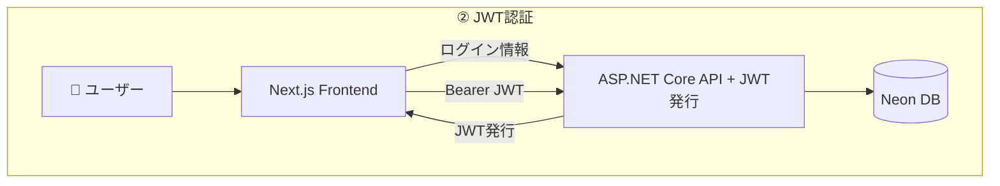

# 認証認可追加

## 構成

```mermaid
graph TD

    subgraph "② JWT認証"
        U2[🧑 ユーザー]
        F2[Next.js Frontend]
        S2[ASP.NET Core API + JWT発行]
        DB2[(Neon DB)]
        U2 --> F2
        F2 -->|ログイン情報| S2
        S2 --> DB2
        S2 -->|JWT発行| F2
        F2 -->|Bearer JWT| S2
    end
```

## 実装
